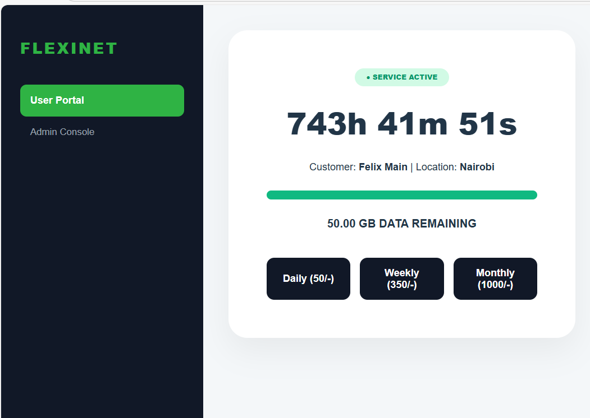
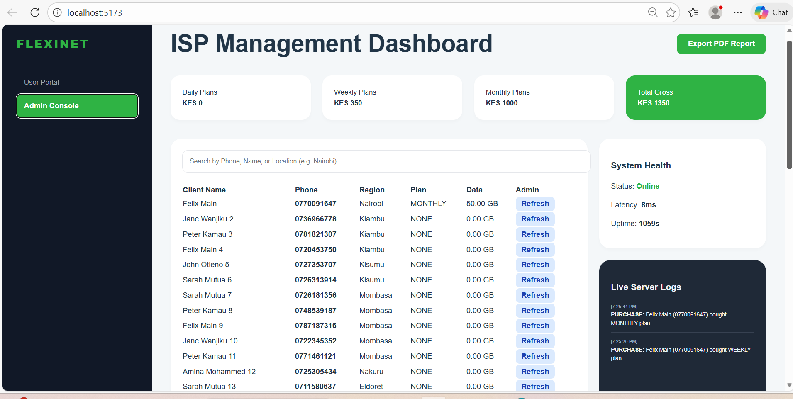

# FlexiNet ISP Core 🚀

**FlexiNet** is a high-scale ISP Management & Provisioning Platform. It mimics enterprise-grade infrastructure by managing real-time data subscriptions, regional network health, and automated billing analytics for a simulated database of millions (mocked at 300+) of clients.

---

## 📸 System Previews

### Customer Portal
The user-facing dashboard where clients manage subscriptions, track data usage, and monitor connection status in real-time.


### Administrative Operations Center
A powerful command center for network engineers to track revenue, monitor system health, and manage regional outages.


---

## 🛠 Key Features
- **Scalable Search Engine:** Instant client lookup by Phone Number, Name, or Region.
- **Revenue Analytics:** Categorized tracking of Daily, Weekly, and Monthly gross income.
- **Regional Maintenance Toggles:** Simulate "Fibre Cuts" or maintenance to notify specific user clusters.
- **Live Activity Feed:** Real-time server logs tracking every transaction and admin action.
- **Location-Aware Provisioning:** Dynamic service delivery based on client geography (Nairobi, Mombasa, etc.).

## 🚀 Tech Stack
- **Frontend:** React.js (Vite), Axios
- **Backend:** Node.js, Express
- **Date Architecture:** date-fns

## ⚙️ Quick Start
1. **Clone the repository:**
   ```bash
   git clone [https://github.com/nahorfelix/flexinet-isp-core.git](https://github.com/nahorfelix/flexinet-isp-core.git)
